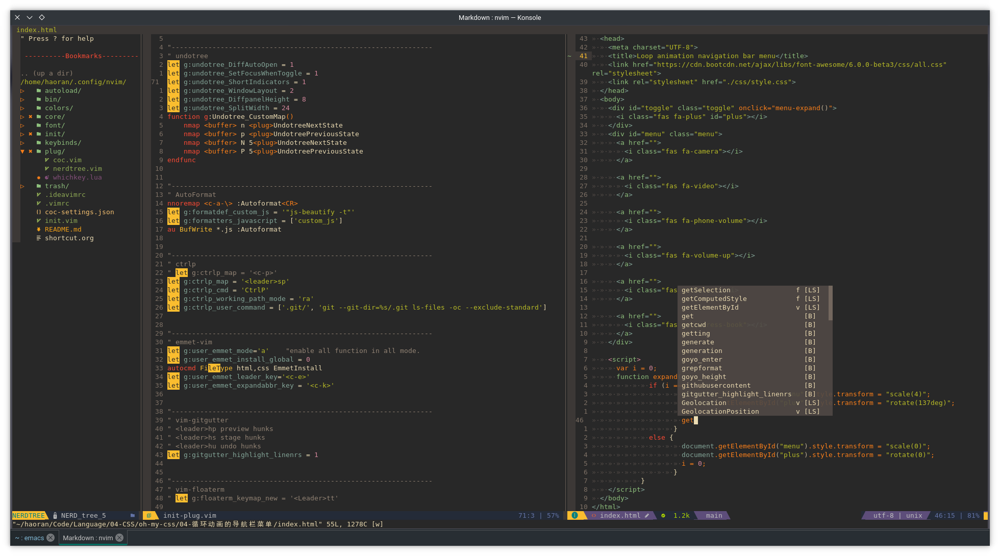

[#](#) Neovim config

1. 备份原 nvim 配置

```bash
cp ~/.config/nvim ~/.config/nvim.bak
```

2. 克隆仓库

```bash
git clone https://github.com/haoran-mc/nvim.git ~/.config/nvim
```

1. 在 nvim 中运行下面命令

```bash
:PlugInstall
```


