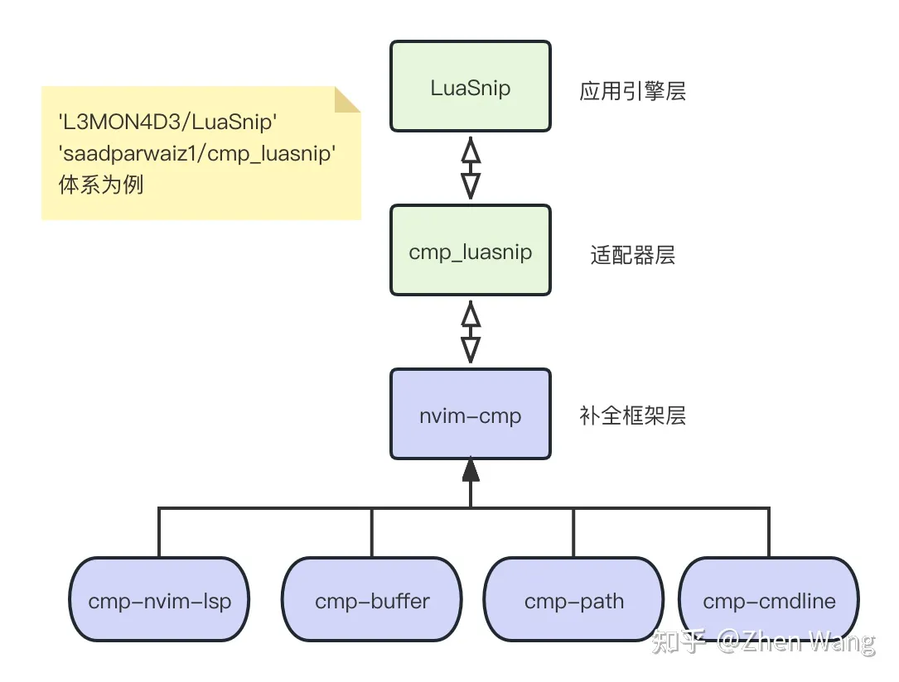

<!-- <leader>mp -->

# 认识 LSP

LSP (Language Server Protocol) 语言服务协议：

LSP 的出现将编程工具解耦成了 Language Server 与 Language Client 两部分。

- Client 代码编辑器文本界面的展示
- Server 代码语言分析（语言支持、自动补全、定义与引用解析、悬停文档提示等）

```js
// 1. 定义接口
interface User {
  name: string;
}
// 2. 实现接口的对象
const user: User = {
  name: 'hello'
}
// 3. 打印对象的age属性
console.log(user.age); // error
```

上述代码打印了 `user` 的 `age` 属性，`user` 并不具备 `age` 字段，所以按照严格的 typescript 语言规范来讲，代码编译会有错误：


使用 LSP 描述这个过程：

1. 在编辑器上写入上述的 ts 代码；
2. 编辑器将上述代码通过某种协议发送给 typescript 语言服务器；
3. typescript 语言服务器读取 ts 代码，进行语法检查，得到了编译错误信息（包含行列数，基本的建议提示信息）返回给编辑器；
4. 编辑器接收到错误信息，通过自己的方式展示在编辑器 UI 上。

使用 LSP 这套体系，有两个必须步骤：

1. 获取并安装语言服务器程序；
2. 启动语言服务器，让它处于运行状态。

# nvim 中的 LSP

在 nvim 0.5+ 版本以后，已经内置了语言服务客户端的接口（[lsp - Neovim docs](https://neovim.io/doc/user/lsp.html) 注意只是语言服务客户端部分），比较常用的 API：

- vim.lsp.buf.hover(): 代码的 tips 悬浮展示；
- vim.lsp.buf.format(): 代码格式化；
- vim.lsp.buf.references(): 当前代码符号的引用查询；
- vim.lsp.buf.implementation(): 当前代码（主要是函数方法）的实现定位；
- vim.lsp.buf.code_action(): 当前代码的一些优化操作。

但需要注意，上面都是接口方法，不具备具体的实现。具体的实现，需要为每一个编程语言单独配置。

所以，面对不同的语言，我们按照对应的语言服务的要求来配置 nvim 的内置 LSP 模块，官方的文档给出了如下的示例来启动一个 LSP：

```lua
vim.lsp.start({
  name = 'my-server-name',
  cmd = {'name-of-language-server-executable'},
  root_dir = vim.fs.dirname(vim.fs.find({'setup.py', 'pyproject.toml'}, { upward = true })[1]),
})
```

这段代码就不介绍了，因为我们将使用 lspconfig 插件，通过它更简单地配置。

# nvim-lspconfig

每当有一个编程语言需要使用 LSP 的时候，我们都需要形如上述的 nvim 原生 LSP 配置来启动对应的语言服务器，同时还需要关注很多细节，譬如，你要手动启动它等等，这一点从用户体验上是比较不友好的。

为了更加方便快速的启动语言服务，nvim 官方提供了 nvim-lspconfig 这个插件，安装了这个插件以后，我们只需要进行少量且易于理解的配置，就能通过这个插件方便快捷的启动并使用语言服务。

**到此我们就已经可以使用 nvim 的 LSP 功能了**

`:h lsp` 查看 LSP 文档的 QUICKSTART 部分：

1. 安装 nvim-lspconfig
2. 安装对应语言的 language server
3. 配置对应语言 `require('lspconfig').xx.setup{…}`
4. `:lua print(vim.inspect(vim.lsp.buf_get_clients()))` 查看 LSP 连接状态

# 以 golang 为例

1. 首先你需要安装 nvim-lspconfig，通过 Packer 安装也好，通过 Lazy 安装也好，通过别的插件管理器安装也好，手动安装也好......
2. 安装对应语言的「语言服务器」，这里安装 go 语言的语言服务器：gopls，

你可以通过 go mod 安装：

```
go get golang.org/x/tools/gopls@latest
```

3. 配置对应语言的 nvim-lspconfig

```lua
require("lspconfig").gopls.setup({
    capabilities = capabilities,
    on_attach = on_attach,
})
```

现在你的 nvim 就具备了语法检查、定义与引用解析、悬停文档提示等功能。

> 注意：现在还不能代码补全，代码补全需要以 LSP 服务为基础，也就是需要上面三个步骤，然后还要安装代码补全的插件，后面会说。

## 介绍 nvim-lspconfig 暴露给用户的方法


# 安装 typescript、JavaScript、Java、Rust、C++、Python、Lua、Lisp、C#、R、Ruby、Swift、Zig、Kotlin、Haskell、Scala、Julia、Lisp、Dart、Perl、Objective-C、D、PHP、Visual Basic、Scratch 的语言服务器

就是这么牛，我什么语言都会。

好的咱们开始配置它们的 nvim LSP 服务吧：

1. 安装 nvim-lspconfig
2. 安装对应语言的 language server
3. 配置对应语言 `require('lspconfig').xx.setup{…}`
4. `:lua print(vim.inspect(vim.lsp.buf_get_clients()))` 查看 LSP 连接状态

在上述的四个步骤中，我们必须要操作 2、3 两个步骤。

## 安装 typescript 的语言服务器

typescript 的语言服务器 typescript-language-server 是一个 npm 包，我们需要通过 `npm -g` 来全局安装它。

然后配置 nvim-lspconfig:

```lua
require("lspconfig").tsserver.setup({
    on_attach = on_attach,
    capabilities = capabilities,
})
```

## 安装 Lua 的语言服务器

Lua 的语言服务器是  lua-language-server，是一个可执行程序，我们需要从网络上下载它存放到电脑上。

我们还需要将这个可执行文件路径加入到环境变量中，以便随时在命令行中启动它们

然后配置 nvim-lspconfig:

```lua
require("lspconfig").lua_ls.setup({
    capabilities = capabilities,
    on_attach = on_attach,
})
```

## 安装 Python 的语言服务器 pyright

```
npm install -g pyright
```

然后配置 nvim-lspconfig:

```lua
require("lspconfig").lua_ls.setup({
    capabilities = capabilities,
    on_attach = on_attach,
})
```

## 安装 Rust 的语言服务器

```
rustup component add rls rust-analysis rust-src
```

然后配置 nvim-lspconfig

## 安装 Ruby 的语言服务器 Solargraph

```
gem install solargraph
```

然后配置 nvim-lspconfig

## 安装... 够了，我受够了

我会那么多的语言，导致我现在需要安装那么多的语言服务器，而且安装方法还不同。

如果后续有升级 pyright、gopls、tsserver 它们的需求，工作量更大。

既要关注这些语言服务器是否升级了，还要手动升级它们。

我受够了，有没有什么东西能够帮我管理它们？

**mason**

mason 可以帮助安装外部 LSP Server，只需要点击几下，就可以安装、更新、删除。

还有 mason-lspconfig 是什么呢？

mason 只负责下载语言服务器，mason-lspconfig 负责寻找并开启语言服务器。如果语言服务器是个二进制文件，那么放入环境变量就能找到；如果语言服务器是个服务，还需要配置服务开启的方式，这时候 mason-lspconfig 就能发挥作用了。然后 nvim-lspconfig 负责将 nvim 内置的语言客户端和下载好的服务器连接起来。

# 下面推荐几个优化 nvim 界面显示的插件

下面这几个插件不是必须的！

## nvim-lspsaga

使用 nvim 内置的 lsp 模块时，它的 UI 展示简陋，nvim-lspsaga 有更好看的 code_action 等的 UI 界面。

## nvim-treesitter

tree-sitter 是一款主要通过 Rust 编写的跨平台的代码解析器生成工具和增量解析库，它可以为源代码文件构建一颗具体语法树。

nvim-treesitter 则是 tree-sitter 和 nvim 之前的封装桥接插件。

在 nvim 中想要体验代码高亮，离不开该插件。

上面的 nvim-lspsaga 就需要依赖 nvim-treesitter。

## null-ls

在内建 LSP，lspconfig 以及 lspsaga 的配合下，nvim 就已经具备了 LSP 能力。

然而还有一个场景没有涵盖到，那就是在语法已经正确的情况下进行代码的处理，包括 prettier 格式化、eslint 代码处理。具体来讲，比如下面这样一段代码：

```javascript
interface User {
          name: string;
}
var user: User = {
          name: "hello"
}
console.log(user);
```

上述这段代码，从 typescript 语法规范的角度来看是没有问题的，完全能够通过 ts 的类型检查。然而，上面的代码有两个问题：

1. 使用 var 来声明一个变量，这已经是不推荐的变量声明方式了；
2. name 字段的格式化不正确，一般我们使用 2 个或 4 个空格来对应一个 tab；

语言服务通常只专注于代码本身的类型检查、代码编译是否正确，不关注代码格式规范、代码使用规范等。

null-ls 被推出，该插件主页提到了这个插件创造出来的动机：

> Neovim doesn't provide a way for non-LSP sources to hook into its LSP client. null-ls is an attempt to bridge that gap and simplify the process of creating, sharing, and setting up LSP sources using pure Lua.
> neovim 没有提供一种非 LSP 源连接到其 LSP 客户端的方式。null-ls 试图弥合这个差距，简化使用纯 lua 创建、共享和设置 LSP 源的过程。

这里面需要解读几点：

1. 什么叫「非 LSP 源」呢？像是 prettier、eslint，它们本身需要对程序代码进行结构、类型解析，然而它们又不关注代码的类型检查等，这类就属于「非 LSP 源」；
2. 什么叫「使用纯 lua 创建、共享和设置 LSP 源的过程」呢？还记得前面的TS语言服务、lua 语言服务吗，他们都是实现了LSP协议的语言服务，各自分别用 js 和 lua 语言编写的，需要外部进程启动。而 null-ls 希望能够用 lua 来编写，构造一个类似支持在 nvim 内部运行语言服务的框架（虽然目前 prettier、eslint 还是外部安装启动的）。同时，使用 null-ls 还可以通过编写 lua 代码，注册自己想要解析的文件进行文本处理：[null-ls.nvim#parsing-buffer-content](https://link.zhihu.com/?target=https%3A//github.com/jose-elias-alvarez/null-ls.nvim%23parsing-buffer-content)。

知道了 null-ls 的作用后，我们该怎么使用这个插件呢：

首先安装好 null-ls 插件的依赖 lspconfig，然后安装 null-ls 插件，最后安装 prettier.nvim 和 eslint.nvim 插件，这两个插件都是利用了 null-ls 的关于 LSP 的接口来和外部安装的 prettier、eslint 命令行工具进行调用。

# nvim 的代码补全：nvim-cmp

## nvim-cmp 简介

nvim-cmp 是一款通过 lua 编写的，nvim 中的代码补全引擎框架插件。代码补全，离不开 snippet（片段），因为最终补全的时候，引擎会将一个又一个的代码片段提供出来让用户选择使用，进而补全当前的代码。当然，这些 snippet 不是平白无故出现的，它们一般从某些地方搜集而来，而这些搜集的来源，就是片段源。片段源可以有很多，比如代码语法树中的 token，命令行支持的指令，各种 git 的指令，文件系统路径等。nvim-cmp 以解耦思想进行设计，将各种不同的片段获取来源分离在了不同的插件中。通常，安装 nvim-cmp 的时候，都会安装如下的几个插件：

```
'neovim/nvim-lspconfig'
'hrsh7th/cmp-nvim-lsp'
'hrsh7th/cmp-buffer'
'hrsh7th/cmp-path'
'hrsh7th/cmp-cmdline'
'hrsh7th/nvim-cmp'
```

- cmp-nvim-lsp 是来源于语言服务分析整个工程得到的片段源，所以它依赖 nvim-lspconfig；
- cmp-buffer 则是当前打开的文件内容通过文本解析得到的片段源；
- cmp-path 则是通过对系统文件路径得到的片段源，譬如当你键入 `/` 的时候，可以展示可用的文件路径供你补全；
- cmp-cmdline 是通过解析命令行得到的源；
- 最后的 nvim-cmp 则是核心引擎框架。

除上述以外，还有其他的来源或实现，可以查看这里来获得已知的源：[List of sources · hrsh7th/nvim-cmp Wiki](https://link.zhihu.com/?target=https%3A//github.com/hrsh7th/nvim-cmp/wiki/List-of-sources)。

此外，还会发现，在 nvim-cmp 的官方配置的示例中，除了上述的引擎和源以外，还有如下插件需要安装：

```
// For vsnip users.
'hrsh7th/cmp-vsnip'
'hrsh7th/vim-vsnip'

// For luasnip users.
'L3MON4D3/LuaSnip'
'saadparwaiz1/cmp_luasnip'

// For ultisnips users.
'SirVer/ultisnips'
'quangnguyen30192/cmp-nvim-ultisnips'

// For snippy users.
'dcampos/nvim-snippy'
'dcampos/cmp-snippy'
```

实际上，nvim-cmp 不负责具体的补全操作，它的核心能力是根据各种源搜集供补全的文本片段，并提供了对这些片段的访问能力。而上述的一套插件，以 `L3MON4D3/LuaSnip` 配合 `saadparwaiz1/cmp_luasnip` 为例，LuaSnip 是核心的代码补全操作引擎插件，他提供补全过程中 UI 操作等能力；而 cmp_luasnip 则是作为了 nvim-cmp 和 LuaSnip 之间的桥梁，就像适配器一样。这个架构如下：



此外，我们一般还会添加两个插件 `rafamadriz/friendly-snippets` 和 `onsails/lspkind-nvim` 来扩展补全体验。前者会提供我们编写代码的时候，大多数常见代码的 snippet（就像 try catch 等），这块的加载下面单独介绍；而后者则是在代码补全的后选项添加图标。

<!-- ## nvim-cmp 基础使用 -->


参考：[详解nvim内建LSP体系于基于nvim-cmp的代码补全体系](https://zhuanlan.zhihu.com/p/643033884)

